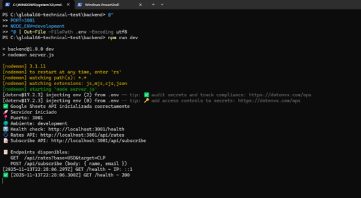
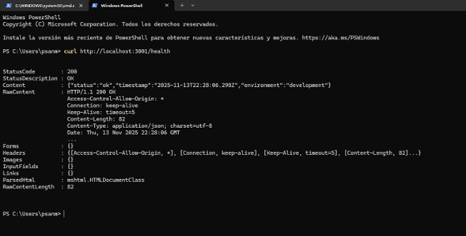
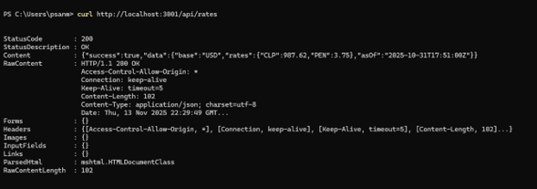
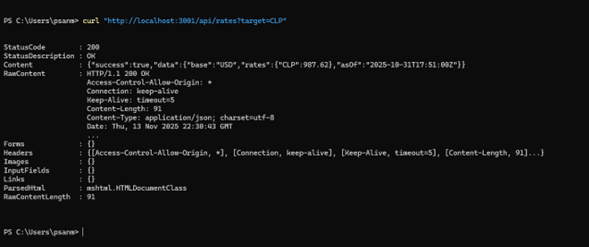
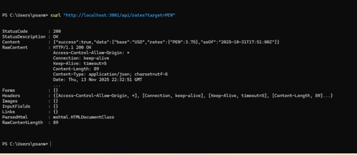
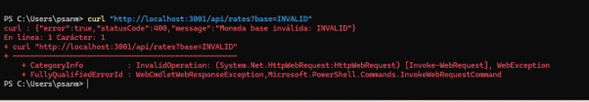
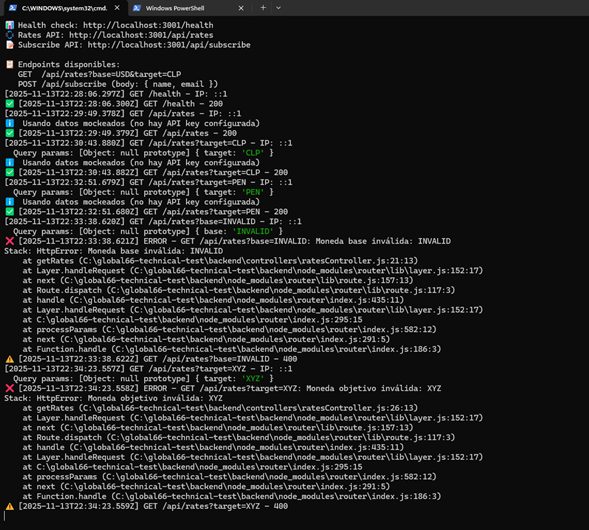

# Global66 Technical Test - Backend API (Parte C)

API REST desarrollada con Express.js para la prueba técnica de Lead Web Frontend de Global66.

## 📋 Descripción

Backend API que proporciona:
- **Endpoint GET `/api/rates`**: Obtiene tasas de cambio de divisas (con soporte para API externa o datos mockeados)
- **Endpoint POST `/api/subscribe`**: Guarda datos de suscripción (name y email) en Google Spreadsheet

### 📊 Google Spreadsheet (Público)

Los datos guardados mediante el endpoint POST `/api/subscribe` se almacenan en el siguiente Google Spreadsheet público:

🔗 **[Ver Google Spreadsheet](https://docs.google.com/spreadsheets/d/1OV3eH8dEYMguyZAVdrUwhJPTdGBHgb7s0TORRrodeus/edit?usp=sharing)**

El spreadsheet contiene las siguientes columnas:
- **Timestamp**: Fecha y hora de la suscripción (formato ISO)
- **Name**: Nombre del usuario
- **Email**: Email del usuario

## 🚀 Requisitos Previos

- **Node.js**: Versión 14.x o superior
- **npm**: Versión 6.x o superior
- **Google Cloud Account**: Para configurar Google Sheets API (opcional, solo si se usa el endpoint POST)

## 📦 Instalación

1. **Clonar el repositorio** (si aún no lo has hecho):
```bash
cd backend
```

2. **Instalar dependencias**:
```bash
npm install
```

3. **Configurar variables de entorno**:
```bash
# En Windows PowerShell:
Copy-Item env.example .env

# En Linux/Mac:
cp env.example .env
```

4. **Editar `.env`** con tus configuraciones:
```env
PORT=3001
NODE_ENV=development

# Google Sheets (opcional, solo para POST /api/subscribe)
GOOGLE_SHEETS_SPREADSHEET_ID=tu_spreadsheet_id_aqui
GOOGLE_SHEETS_RANGE=Sheet1!A:B
GOOGLE_SHEETS_CREDENTIALS_PATH=./config/google-credentials.json

# API Externa de Tasas (opcional)
EXCHANGE_RATE_API_KEY=tu_api_key_aqui
EXCHANGE_RATE_API_URL=https://api.exchangerate-api.com/v4/latest
```

## 🔧 Configuración de Google Sheets API

El endpoint POST `/api/subscribe` requiere configuración de Google Sheets API. Si no lo configuras, ese endpoint retornará un error 503.

### Pasos para configurar:

1. **Crear proyecto en Google Cloud Console**:
   - Ve a [Google Cloud Console](https://console.cloud.google.com/)
   - Crea un nuevo proyecto o selecciona uno existente

2. **Habilitar Google Sheets API**:
   - En el menú lateral, ve a "APIs & Services" > "Library"
   - Busca "Google Sheets API" y habilítala

3. **Crear Service Account**:
   - Ve a "APIs & Services" > "Credentials"
   - Click en "Create Credentials" > "Service Account"
   - Completa el formulario y crea el Service Account

4. **Generar credenciales JSON**:
   - Click en el Service Account creado
   - Ve a la pestaña "Keys"
   - Click en "Add Key" > "Create new key" > "JSON"
   - Descarga el archivo JSON

5. **Guardar credenciales**:
   - Mueve el archivo JSON descargado a `backend/config/google-credentials.json`
   - **⚠️ IMPORTANTE**: Este archivo está en `.gitignore` por seguridad

6. **Crear y compartir Google Spreadsheet**:
   - Crea un nuevo Google Spreadsheet
   - Copia el **Spreadsheet ID** de la URL (ej: `https://docs.google.com/spreadsheets/d/SPREADSHEET_ID/edit`)
   - Comparte el spreadsheet con el **email del Service Account** (encontrado en el JSON de credenciales, campo `client_email`)
   - Dale permisos de "Editor" al Service Account

7. **Configurar variables de entorno**:
   - En tu `.env`, agrega el `GOOGLE_SHEETS_SPREADSHEET_ID`
   - Configura `GOOGLE_SHEETS_RANGE` (ej: `Sheet1!A:B` para columnas A y B)

### Estructura del Spreadsheet:

El spreadsheet debe tener al menos estas columnas:
- **Columna A**: Timestamp (se agrega automáticamente)
- **Columna B**: Name
- **Columna C**: Email

Ejemplo de `GOOGLE_SHEETS_RANGE`: `Sheet1!A:C`

## 🏃 Ejecución

### Modo Desarrollo (con nodemon):
```bash
npm run dev
```

### Modo Producción:
```bash
npm start
```

El servidor estará disponible en `http://localhost:3001` (o el puerto configurado en `.env`)

## 📡 Endpoints

### 1. Health Check

**GET** `/health`

Verifica el estado del servidor.

**Respuesta exitosa (200)**:
```json
{
  "status": "ok",
  "timestamp": "2025-11-13T18:45:00.000Z",
  "environment": "development"
}
```

---

### 2. Obtener Tasas de Cambio

**GET** `/api/rates`

Obtiene tasas de cambio de divisas. Intenta obtener de API externa si está configurada, sino usa datos mockeados.

**Query Parameters** (opcionales):
- `base`: Moneda base (default: `USD`)
- `target`: Moneda objetivo (opcional, filtra solo esa tasa)

**Ejemplos**:
```bash
# Obtener todas las tasas (base USD)
GET /api/rates

# Obtener tasas con base específica
GET /api/rates?base=USD

# Obtener tasa específica USD -> CLP
GET /api/rates?base=USD&target=CLP

# Obtener tasa específica USD -> PEN
GET /api/rates?target=PEN
```

**Respuesta exitosa (200)**:
```json
{
  "success": true,
  "data": {
    "base": "USD",
    "rates": {
      "CLP": 987.62,
      "PEN": 3.75
    },
    "asOf": "2025-10-31T17:51:00Z"
  }
}
```

**Respuesta con target específico (200)**:
```json
{
  "success": true,
  "data": {
    "base": "USD",
    "rates": {
      "CLP": 987.62
    },
    "asOf": "2025-10-31T17:51:00Z"
  }
}
```

**Errores posibles**:
- `400`: Moneda inválida
- `404`: Tasa no encontrada para el target especificado
- `500`: Error interno del servidor

---

### 3. Suscripción (Guardar en Google Sheets)

**POST** `/api/subscribe`

Guarda datos de suscripción (name y email) en Google Spreadsheet.

**Body** (JSON):
```json
{
  "name": "Juan Pérez",
  "email": "juan@example.com"
}
```

**Validaciones**:
- `name`: Requerido, entre 2 y 100 caracteres
- `email`: Requerido, debe ser un email válido

**Ejemplo de request**:
```bash
curl -X POST http://localhost:3001/api/subscribe \
  -H "Content-Type: application/json" \
  -d '{
    "name": "Juan Pérez",
    "email": "juan@example.com"
  }'
```

**Respuesta exitosa (201)**:
```json
{
  "success": true,
  "message": "Datos guardados correctamente",
  "data": {
    "name": "Juan Pérez",
    "email": "ju***@example.com"
  }
}
```

**Errores posibles**:
- `400`: Error de validación (campos requeridos, formato inválido)
- `403`: Sin permisos para acceder al Spreadsheet
- `404`: Spreadsheet no encontrado
- `500`: Error interno del servidor
- `503`: Google Sheets API no configurada

---

## 🧪 Testing

### Probar endpoints con curl:

**Health Check**:
```bash
curl http://localhost:3001/health
```

**Obtener todas las tasas**:
```bash
curl http://localhost:3001/api/rates
```

**Obtener tasa específica**:
```bash
curl "http://localhost:3001/api/rates?base=USD&target=CLP"
```

**Suscribirse**:
```bash
curl -X POST http://localhost:3001/api/subscribe \
  -H "Content-Type: application/json" \
  -d '{"name":"Test User","email":"test@example.com"}'
```

### Probar endpoints con Postman:

1. Importa la colección de Postman (si está disponible)
2. O crea requests manuales usando los ejemplos de arriba

## 📁 Estructura del Proyecto

```
backend/
├── config/
│   └── googleSheets.js          # Configuración de Google Sheets API
├── controllers/
│   ├── ratesController.js       # Controller para /api/rates
│   └── subscribeController.js  # Controller para /api/subscribe
├── middleware/
│   └── requestLogger.js        # Middleware de logging
├── routes/
│   ├── ratesRoutes.js          # Rutas de tasas
│   └── subscribeRoutes.js      # Rutas de suscripción
├── services/
│   ├── exchangeRateService.js   # Servicio de tasas de cambio
│   └── googleSheetsService.js  # Servicio de Google Sheets
├── utils/
│   ├── errorHandler.js          # Manejo centralizado de errores
│   └── logger.js                # Utilidades de logging
├── .env.example                 # Ejemplo de variables de entorno
├── .gitignore                   # Archivos ignorados por Git
├── package.json                 # Dependencias del proyecto
├── README.md                     # Este archivo
└── server.js                    # Archivo principal del servidor
```

## 🔍 Logging

El servidor registra automáticamente:
- **Requests entrantes**: Método, URL, IP, query params, body (sanitizado)
- **Responses**: Status code y mensaje
- **Errores**: Stack trace completo en desarrollo

Ejemplo de log:
```
[2025-11-13T18:45:00.000Z] GET /api/rates?base=USD&target=CLP - IP: ::1
  Query params: { base: 'USD', target: 'CLP' }
✅ [2025-11-13T18:45:00.100Z] GET /api/rates?base=USD&target=CLP - 200
```

## ⚠️ Notas Importantes

1. **Google Sheets API**: El endpoint POST requiere configuración. Si no está configurado, retornará error 503.

2. **Datos Mockeados**: Si no hay API key de tasas configurada, se usan datos mockeados (CLP: 987.62, PEN: 3.75).

3. **Seguridad**: 
   - Nunca subas el archivo `google-credentials.json` a Git
   - El archivo está en `.gitignore` por defecto
   - Usa variables de entorno para datos sensibles

4. **CORS**: El servidor tiene CORS habilitado por defecto. En producción, configura los orígenes permitidos.

## 🐛 Troubleshooting

### Error: "Google Sheets API no está configurada"
- Verifica que el archivo `google-credentials.json` existe en `config/`
- Verifica que las variables de entorno están configuradas en `.env`

### Error: "Spreadsheet no encontrado"
- Verifica que el `GOOGLE_SHEETS_SPREADSHEET_ID` es correcto
- Asegúrate de que el spreadsheet existe y está compartido con el Service Account

### Error: "Sin permisos para acceder al Spreadsheet"
- Comparte el spreadsheet con el email del Service Account (encontrado en `google-credentials.json`)
- Dale permisos de "Editor"

### Puerto ya en uso
- Cambia el puerto en `.env` o termina el proceso que está usando el puerto 3001

## 📸 Evidencia de Pruebas

Se realizaron pruebas manuales exhaustivas de todos los endpoints. Las capturas de pantalla que demuestran el funcionamiento correcto del backend se encuentran en [`docs/screenshots/`](./docs/screenshots/).

### Capturas principales:

#### 1. Servidor iniciado correctamente

*Servidor corriendo en puerto 3001 con todos los endpoints disponibles y Google Sheets API inicializada*

#### 2. Health Check exitoso

*Endpoint `/health` respondiendo correctamente con status 200*

#### 3. GET `/api/rates` - Todas las tasas

*Endpoint GET `/api/rates` retornando todas las tasas de cambio (CLP y PEN)*

#### 4. GET `/api/rates` con filtro por target

*Endpoint GET `/api/rates?target=CLP` filtrando correctamente solo la tasa de CLP*

#### 5. Manejo de errores - Moneda inválida

*Manejo correcto de errores: retorna 400 cuando se envía una moneda inválida*

#### 6. POST `/api/subscribe` exitoso

*Endpoint POST `/api/subscribe` guardando datos correctamente en Google Sheets*

#### 7. Datos guardados en Google Sheets

*Verificación en Google Spreadsheet: los datos se guardaron correctamente con timestamp, name y email*

### Resumen de pruebas realizadas:

Estas capturas confirman que:
- ✅ El servidor inicia correctamente con todas las dependencias
- ✅ Los endpoints responden con los códigos HTTP esperados (200, 400, 500)
- ✅ La validación de queries funciona correctamente
- ✅ El manejo de errores es coherente y descriptivo
- ✅ La integración con Google Sheets funciona correctamente
- ✅ Los datos se guardan en el spreadsheet público con el formato esperado
- ✅ El logging de requests funciona en consola

Todas las capturas de pantalla están disponibles en [`docs/screenshots/`](docs/screenshots/).

## 📝 Licencia

Este proyecto es parte de una prueba técnica para Global66.

## 👤 Autor

psanmartin2022

